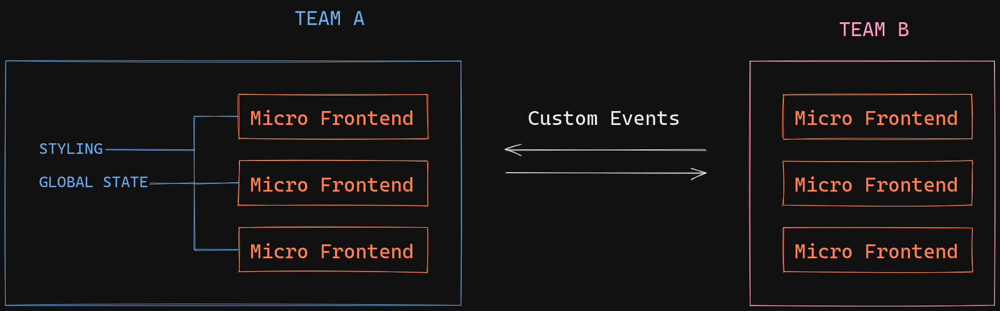
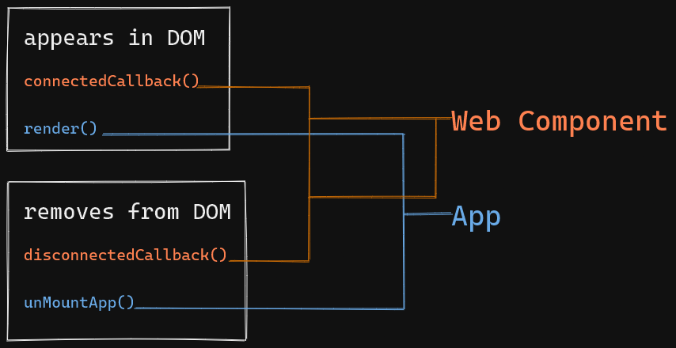

# Container App Overview

This is the Micro-Frontend W/ Web Component Container. In this container we used React to Encapsulate All the Micro-frontend inside a single App. We can use any frontend framework but we'll use React because it's the most popular and heavily supported frontend library right now.

### How it works

In this container app It'll handle all the routing and the layout of the app itself and have a special component to initiate the Micro-frontend.


### MicroFrontEnd Container App Component

This Component needs two props, the 'url' of the js script and 'render' to render the web component element.

```javascript
// container App
const MicroFrontend = ({ url, render }) => {
....
}
export default MicroFrontend
```

you can register the microfrontend script url in the app.config.js file.

```js
// container app

export default {
  teamProductUrl: import.meta.env.SNOWPACK_PUBLIC_TEAM_PRODUCT_URL,
  teamCheckoutUrl: import.meta.env.SNOWPACK_PUBLIC_TEAM_CHECKOUT_URL,
};
```

after you configure the script url it's all set and you can initiate the Micro-frontend App like below.

```javascript
// container App
...
<Link to="/cart">
  <MicroFrontend
    url={`${appConfig.teamCheckoutUrl}/dist/minicart/index.js`}
    render={<team-checkout-minicart></team-checkout-minicart>}
  />
</Link>
...
```

```javascript
// micro frontend App
...
customElements.define("team-checkout-minicart", AddToCart)
```

notice that the render prop need to have the same element name as it's declared on its own app.

# Web Component Micro-frontend App Overview

This is the actuall Micro-frontend itself it'll handle all the state, styling and how each of Microfrontends communicate.



## Custom Element

One of the key features of the Web Components standard is the ability to create custom elements that encapsulate your functionality on an HTML page, rather than having to make do with a long, nested batch of elements that together provide a custom page feature. - MDN



When the web component custom elements appear on the dom the connectedCallback method gets called and render the app and when the custom element gets removed from the dom the disconnectedCallback method gets called and the app gets unmounted from the node.

these are the basics lifecycle methods of a custom element :
- connectedCallback()
  this method is called when the custom element added to the dom, so we can intialize the micro-frontend app inside this method
- disconnectedCallback()
  this method is called when the custom element is about to be removed from the dom, this is very usefull to unMount our app and clean up all async functions from the micro-frontend app.
- The attributeChangedCallback()
  callback is run whenever one of the element's attributes is changed in some way. when we passed an attribute to the custom element we can listen whenever its value changes, and then we can render the necessary state. 
```jsx
<team-checkout-addtocart product={JSON.stringify(product)} />
```

```js
export default class AddToCart extends HTMLElement {
  static get observedAttributes() {
    return ['product'];
  }
  attributeChangedCallback(name, oldValue, newValue) {
    this.render();
  }
  connectedCallback() {
    this.render();
  }
  render() {
    AddToCartApp.render(this, {
      product: JSON.parse(this.getAttribute('product'))
        ? JSON.parse(this.getAttribute('product'))
        : undefined,
    });
  }
}
```

## Costum Event

When we cannot pass the data directly to the custom element attributes we can use the custom event API
```js
// add an appropriate event listener
cart.addEventListener("add:to:cart", function(e) { process(e.detail) });

// create and dispatch the event
const event = new CustomEvent("add:to:cart", {
  detail: {
    someProduct
  }
});

addToCartBtn.addEventListener('click', (e){
  e.target.dispatchEvent(event)
})
```


## Global State

to handle global state we use redux micro frontend. it's created by the microsoft team. you can read about it more here https://github.com/microsoft/redux-micro-frontend .

### 1. Initiate Global Store

In this example we use React custom hook to initiate the state and the global store

```js
export default function useCart() {
  let [cart, setCart] = useState([]);
  let globalStore = GlobalStore.Get();
  ...
```

Inside useCart() we initiate the 'cart' global store inside the useEffect when the component first render. we create isMounted variable to track when the component will be unMounted, then we create the store `globalStore.CreateStore("cart", reducer);`. if there is data inside the store we update the local cart state to the globalStore cart state so it stay in sync. after that we subscribe to the globalStore state. `globalStore.SubscribeToGlobalState("cart", (globalState)`

```js
export default function useCart() {
  ...
  useEffect(() => {
    let isMounted = true;
    globalStore.CreateStore("cart", reducer);
    const globalState = globalStore.GetGlobalState().cart;
    setCart(globalState);
    globalStore.SubscribeToGlobalState("cart", (globalState) => {
      if (isMounted) {
        setCart(globalState.cart);
      }
    });
    return () => {
      isMounted = false;
    };
  }, []);
  ...
```

after that we create a function to dispatch action inside the custom hooks

```js
let dispatch = (action) => {
  globalStore.DispatchAction('cart', action);
};
```

finally we return the cart state and dispatch function ready to be used!

```js
export default function useCart() {
  ...
  return {
    cart,
    dispatch,
  };
}
```

```jsx
const Checkout = () => {
  const {cart} = useCart()
  return (
    cart.map()...
  )
}
```

```jsx
const AddToCartBtn = ({ product }) => {
  const { dispatch } = useCart();
  return (
    <button
      onClick={() => {
        dispatch({ type: 'ADD', payload: product });
      }}
    >
      Add To cart
    </button>
  );
};
```

## Sharing css between Micro-frontend


## Reference

- https://micro-frontends.org/
- https://developer.mozilla.org/en-US/docs/Web/Web_Components
- https://developer.mozilla.org/en-US/docs/Web/API/CustomEvent/CustomEvent
