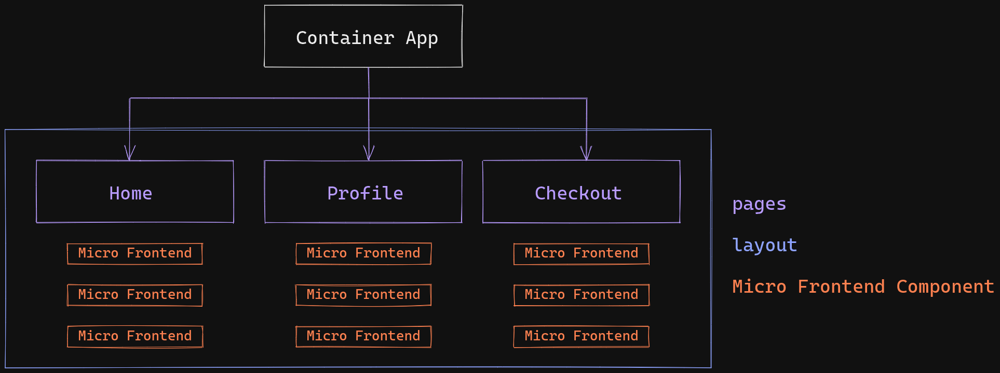

# Overview

This is the Micro-Frontend W/ Web Component Container. In this container we used React to Encapsulate All the Micro-frontend inside a single App. We can use any frontend framework but we'll use React because it's the most popular and heavily supported frontend library right now.

### How it works

In this container app It'll handle all the routing and the layout of the app itself and have a special component to initiate the Micro-frontend.



### MicroFrontEnd Container App Component

This Component needs two props, the 'url' of the js script and 'render' to render the web component element.

```javascript
// container App
const MicroFrontend = ({ url, render }) => {
....
}
export default MicroFrontend
```

you can register the microfrontend script url in the app.config.js file.

```js
// container app

export default {
  teamProductUrl: import.meta.env.SNOWPACK_PUBLIC_TEAM_PRODUCT_URL,
  teamCheckoutUrl: import.meta.env.SNOWPACK_PUBLIC_TEAM_CHECKOUT_URL,
};
```

after you configure the script url it's all set and you can initiate the Micro-frontend App like below.

```javascript
// container App
...
<Link to="/cart">
  <MicroFrontend
    url={`${appConfig.teamCheckoutUrl}/dist/minicart/index.js`}
    render={<team-checkout-minicart></team-checkout-minicart>}
  />
</Link>
...
```

```javascript
// micro frontend App
...
customElements.define("team-checkout-minicart", AddToCart)
```

notice that the render prop need to have the same element name as it's declared on its own app.

## Web Component Micro-frontend App

https://github.com/microsoft/redux-micro-frontend
